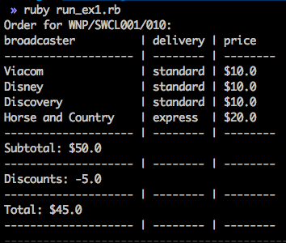
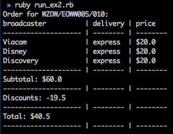
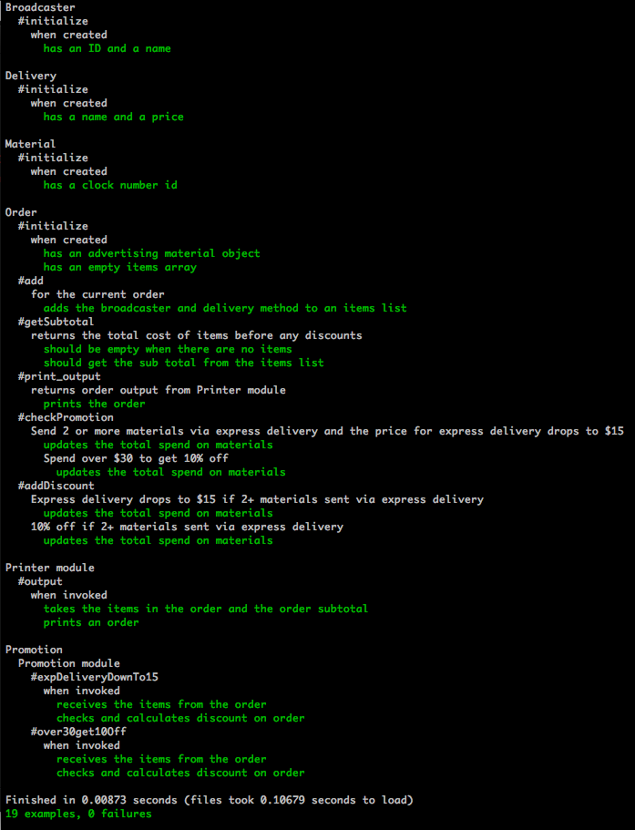

# Honeycomb Engineering Test - Makers Edition

**Solution built by [Shereen Finney](https://github.com/shezdev) on 12th May 2017**

## Getting started

- Run `git clone https://github.com/shezdev/honeycomb-makers-test`
- `cd honeycomb-makers-test` (root directory)
- Run `bundle install` in the root directory

## Usage
- Run `ruby run_ex1.rb` to execute the first example, which should look like this:

- Run `ruby run_ex2.rb` to execute the second example, which should look like this:

## Running tests
- I used a test-driven approach to build this functionality using RSpec.
- To test:
- Run `rspec` from the `root` directory
- Currently shows `19 examples, 0 failures`

## My Approach / Solution
- Most of the functionality was provided in the example given to us in /example
- I re-wrote the functionality from scratch using a TDD Approach
- I delegated output/printing to a Printer module, that mixed in to the Order class.
- When it came to building the new functionality (a mechanism for applying Discounts to orders), I built another module called "Promotions", that also mixed in to the Order class.

## The challenge

We have a system that delivers advertising materials to broadcasters.

Advertising Material is uniquely identified by a 'Clock' number e.g.

* `WNP/SWCL001/010`
* `ZDW/EOWW005/010`

Our sales team have some new promotions they want to offer so
we need to introduce a mechanism for applying Discounts to orders.

Promotions like this can and will change over time so we need the solution to be flexible.

### Broadcasters

These are the Broadcasters we deliver to

* Viacom
* Disney
* Discovery
* ITV
* Channel 4
* Bike Channel
* Horse and Country

### Delivery Products

* Standard Delivery: $10
* Express Delivery: $20

### Discounts

* Send 2 or more materials via express delivery and the price for express delivery drops to $15
* Spend over $30 to get 10% off

### What we want from you

Provide a means of defining and applying various discounts to the cost of delivering material to broadcasters.

We don't need any UI for this, we just need you to show us how it would work through its API.

## Examples

Based on the both Discounts applied, the following examples should be valid:

* send `WNP/SWCL001/010` to Disney, Discovery, Viacom via Standard Delivery and Horse and Country via Express Delivery
    based on the defined Discounts the total should be $45.00

* send `ZDW/EOWW005/010` to Disney, Discovery, Viacom via Express Delivery
     based on the defined Discounts the total should be $40.50
